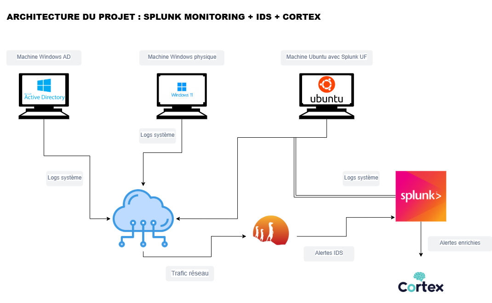

# 📊 Projet Splunk Monitoring – Cybersécurité

## 🔎 Objectif
Ce projet vise à mettre en place un système de monitoring de sécurité basé sur **Splunk**, avec détection réseau via **Suricata** et enrichissement d’alertes via **Cortex**.

## 🧱 Architecture

### Composants principaux :
- 🖥️ Ubuntu : avec **Splunk UF**
- 🪟 Windows 11 physique : avec **Splunk UF**
- 🪟 Windows Active Directory : avec **Splunk UF** + rôles AD
- 🛡️ Suricata : IDS pour analyser le trafic réseau
- 📊 Splunk : collecte de logs, alertes
- 🧠 Cortex : enrichissement automatique des IoCs (IP, hash, domaine)

---

## 🛠️ Installation (en cours)

- ✅ Splunk Enterprise installé localement
- ✅ Agents Splunk déployés sur 3 machines
- ✅ Intégration de Suricata en cours
- 🔜 Intégration Cortex (partie SOAR)
- 🔜 Partie Pentesting (dernière étape)

---

## 📁 Arborescence du dépôt

splunk-monitoring-project/
├── docs/ # 📂 Images et documentation
│ └── architecture.png # 🧱 Schéma d'architecture
├── splunk-rules/ # 📄 Requêtes et règles Splunk
├── suricata/ # 🛡️ Configs Suricata (bientôt)
├── cortex/ # 🧠 Scripts ou captures Cortex
├── soar/ # 🔁 Scripts de réponse automatique (à venir)
├── README.md # 📝 Description du projet

## 🧪 Tests effectués

- ✅ Détection des connexions RDP suspectes
- ✅ Ajout dans `Domain Admins`
- ✅ Connexions à des heures inhabituelles

## 🔄 À venir

- ⚙️ Scripts automatiques de réponse (SOAR léger)
- 🔒 Simulation de pentesting
- 📊 Dashboard Splunk personnalisé
